# 🎥 OPAL - Advanced Screen Recording & Video Management Platform

<div align="center">


**A powerful, multi-platform video recording and management solution built with modern web technologies**

[](https://typescriptlang.org/)
[](https://reactjs.org/)
[](https://nextjs.org/)
[](https://electronjs.org/)
[](https://prisma.io/)
[](https://tailwindcss.com/)

[🚀 Quick Start](#-quick-start) • [📖 Documentation](#-documentation) • [🛠️ Features](#-features) • [🏗️ Architecture](#-architecture)

</div>

---

## 🌟 Overview

OPAL is a comprehensive video recording and management platform that provides seamless screen recording capabilities across multiple platforms. Built with a modern tech stack, it offers both web-based and desktop applications, along with a robust backend infrastructure.

### 🎯 Key Highlights

- 🖥️ **Cross-Platform**: Desktop app, web application, and server components
- 📹 **Advanced Recording**: High-quality screen and webcam recording
- 🎨 **Modern UI**: Beautiful, responsive interface built with React and Tailwind CSS
- 🔐 **Secure Authentication**: Integrated with Clerk for user management
- 📊 **Video Management**: Comprehensive dashboard for organizing and managing recordings
- ☁️ **Cloud Storage**: AWS S3 integration for scalable video storage

## 🏗️ Architecture

```mermaid
graph TB
    A[🌐 Web App - Next.js] --> D[🔧 Express Server]
    B[🖥️ Desktop App - Electron] --> D
    C[📱 Mobile Web] --> A
    D --> E[🗄️ PostgreSQL + Prisma]
    D --> F[☁️ AWS S3 Storage]
    D --> G[🔐 Clerk Authentication]
    
    style A fill:#61dafb
    style B fill:#191970
    style D fill:#339933
    style E fill:#336791
    style F fill:#ff9900
```



### 🏢 Project Structure

```
OPAL/
├── 🌐 opal-web-version/          # Next.js Web Application
├── 🖥️ opal-desktop-version/      # Electron Desktop App
├── 🔧 opal-express-version/      # Express.js Backend Server
└── 📝 Configuration Files
```

## 🛠️ Features

### 🎥 Recording Capabilities
- **Screen Recording**: Capture entire screen or specific windows
- **Webcam Integration**: Record video with webcam overlay
- **Audio Recording**: High-quality audio capture
- **Studio Mode**: Professional recording environment

### 📊 Management Dashboard
- **Video Library**: Organize and categorize recordings
- **Workspace Management**: Create and manage multiple workspaces
- **User Analytics**: Track usage and engagement metrics
- **Sharing Controls**: Granular permissions and sharing options

### 🔧 Technical Features
- **Real-time Processing**: Live video processing and optimization
- **Cloud Sync**: Automatic synchronization across devices
- **API Integration**: RESTful API for third-party integrations
- **Responsive Design**: Optimized for all screen sizes

## 🚀 Quick Start

### Prerequisites

- **Node.js** (v18 or higher)
- **Bun** runtime
- **PostgreSQL** database
- **AWS S3** bucket (for storage)
- **Clerk** account (for authentication)

### 🔧 Installation

1. **Clone the repository**
```bash
git clone https://github.com/Surajadde07/OPAL-DESKTOP.git
cd OPAL-DESKTOP
```

2. **Install dependencies for all projects**
```bash
# Web version
cd opal-web-version
bun install

# Desktop version
cd ../opal-desktop-version
npm install

# Express server
cd ../opal-express-version
npm install
```

3. **Environment Setup**

Create `.env` files in each project directory:

**Web Version (.env.local)**
```bash
NEXT_PUBLIC_CLERK_PUBLISHABLE_KEY=your_clerk_key
CLERK_SECRET_KEY=your_clerk_secret
DATABASE_URL=your_postgres_connection_string
```

**Express Server (.env)**
```bash
AWS_ACCESS_KEY_ID=your_aws_access_key
AWS_SECRET_ACCESS_KEY=your_aws_secret
AWS_REGION=your_aws_region
S3_BUCKET_NAME=your_s3_bucket
```

4. **Database Setup**
```bash
cd opal-web-version
npx prisma generate
npx prisma db push
```

### 🏃‍♂️ Running the Applications

**Development Mode:**

```bash
# Terminal 1 - Web Application
cd opal-web-version
bun dev

# Terminal 2 - Express Server
cd opal-express-version
npm run dev

# Terminal 3 - Desktop Application
cd opal-desktop-version
npm run dev
```

**Production Build:**

```bash
# Web version
cd opal-web-version
bun run build

# Desktop version
cd opal-desktop-version
npm run build

# Express server
cd opal-express-version
npm start
```

## 📱 Applications

### 🌐 Web Application (Next.js)
- **Port**: `http://localhost:3000`
- **Features**: Full web-based recording and management
- **Technologies**: Next.js 14, React 18, Tailwind CSS, Prisma

### 🖥️ Desktop Application (Electron)
- **Platform**: Windows, macOS, Linux
- **Features**: Native desktop recording capabilities
- **Technologies**: Electron, React, TypeScript, Vite

### 🔧 Backend Server (Express)
- **Port**: `http://localhost:8000`
- **Features**: API endpoints, file processing, cloud storage
- **Technologies**: Express.js, AWS SDK, Multer

## 🎨 UI Components

Built with a comprehensive design system:

- **Radix UI**: Accessible, unstyled UI primitives
- **Tailwind CSS**: Utility-first CSS framework
- **Custom Components**: Accordion, Dialog, Button, Form elements
- **Responsive Design**: Mobile-first approach

## 🔐 Authentication & Security

- **Clerk Integration**: Secure user authentication and management
- **JWT Tokens**: Stateless authentication
- **Role-based Access**: Granular permission system
- **Data Encryption**: Secure data transmission and storage

## 📊 Database Schema

```prisma
model User {
  id          String @id @default(cuid())
  email       String @unique
  firstname   String
  lastname    String
  createdAt   DateTime @default(now())
  // ... additional fields
}

model Workspace {
  id          String @id @default(cuid())
  name        String
  type        String
  // ... additional fields
}

// ... additional models
```

## 🤝 Contributing

We welcome contributions! Please see our [Contributing Guidelines](CONTRIBUTING.md) for details.

### Development Workflow

1. Fork the repository
2. Create a feature branch (`git checkout -b feature/amazing-feature`)
3. Commit your changes (`git commit -m 'Add some amazing feature'`)
4. Push to the branch (`git push origin feature/amazing-feature`)
5. Open a Pull Request

## 📄 License

This project is licensed under the MIT License - see the [LICENSE](LICENSE) file for details.

## 🙏 Acknowledgments

- **React Team** for the amazing framework
- **Vercel** for Next.js and deployment platform
- **Electron Team** for cross-platform desktop capabilities
- **Radix UI** for accessible UI components
- **Tailwind CSS** for the utility-first CSS framework

## 📞 Support

- 📧 **Email**: support@opal.dev
- 💬 **Discord**: [Join our community](https://discord.gg/opal)
- 📚 **Documentation**: [docs.opal.dev](https://docs.opal.dev)
- 🐛 **Issues**: [GitHub Issues](https://github.com/Surajadde07/OPAL-DESKTOP/issues)

---

<div align="center">

**Made with ❤️ by the OPAL Team**

[⭐ Star this repo](https://github.com/Surajadde07/OPAL-DESKTOP) • [🐛 Report Bug](https://github.com/Surajadde07/OPAL-DESKTOP/issues) • [✨ Request Feature](https://github.com/Surajadde07/OPAL-DESKTOP/issues)

</div>
